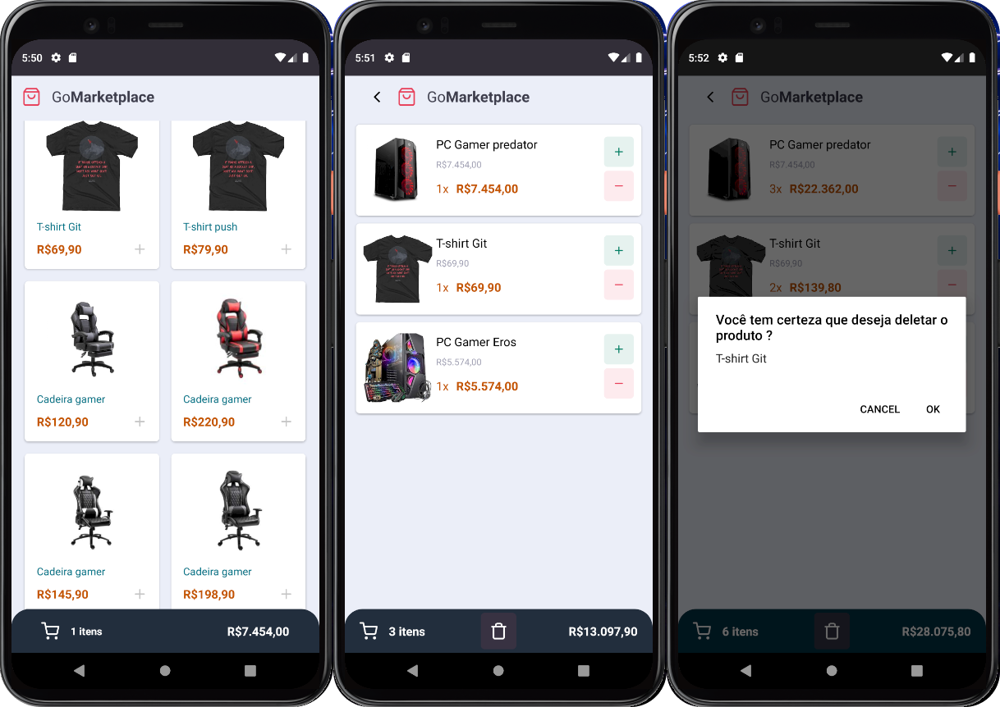

<h1 align="center">GoMarketplace</h1>

<p align="center">
  

  <a href="https://www.linkedin.com/in/helitonoliveira/">
    
  </a>

  

  <a href="https://github.com/helitonoliveiraa/desafio-fundamentos-react-native/stargazers">
    
  </a>
</p>


<p align="center">
  <a href="#memo-sobre-o-desafio">Sobre</a>&nbsp;&nbsp;&nbsp;|&nbsp;&nbsp;&nbsp;
  <a href="#rocket-milha-extra">Milha extra</a>&nbsp;&nbsp;&nbsp;|&nbsp;&nbsp;&nbsp;
  <a href="#wrench-ferramentas-utilizadas">Ferramentas utilizadas</a>&nbsp;&nbsp;&nbsp;|&nbsp;&nbsp;&nbsp;
  <a href="#arrowdown-como-clonar-o-projeto">Baixe o projeto</a>&nbsp;&nbsp;&nbsp;|&nbsp;&nbsp;&nbsp;
  <a href="#pagefacingup-licença">Licença</a>
</p>

<p align="center">
  
</p>

<br />

<p align="center" >
Vídeo demo <br />
  <a href="https://youtu.be/hzD1-pMn6d0">
    
  </a>
</p>


<br />

## :memo: Sobre o desafio

Nesse desafio, coloquei em prática os conhecimentos adqueridos durante as aulas e desenvolvi o GoMarketplace, que é um e-commerce fictício. Consumi uma fake api desenvolvida usando json-server para compor os dados em tela.

Todo o desenvolvimento do desafio foi guiado a testes, então tive de satisfazer as seguintes especificações dos teste;

- ✅ should be able to list the products
- ✅ should be able to add a product to the cart
- ✅ should be able to list the products on the cart
- ✅ should be able to calculate the cart total
- ✅ should be able to show the total quantity of itens in the cart
- ✅ should be able to increment product quantity on the cart
- ✅ should be able to decrement product quantity on the cart
- ✅ should be able to navigate to the cart
- ✅ should be able to add products to the cart
- ✅ should be able to increment quantity
- ✅ should be able to decrement quantity
- ✅ should store products in AsyncStorage while adding, incrementing and decrementing
- ✅ should load products from AsyncStorage

## :rocket: Milha extra

* Incrementei o layout e as cores do app.
* Adicionei a funcionalidade de remover um produto do carrinho utilizando `Context API` e o `LongPress do React Native`.
* Adicionei validação para que não seja possível o usuário tem `0 (zero)` ou `quantidades negativas` no carrinho.
* Adicionei a funcionalidade de remover todos os produtos do carrinho, independente da quantidade.


## :wrench: Ferramentas utilizadas

- [React Native](https://reactnative.dev/)
- [React Nativagion](https://reactnavigation.org/docs/hello-react-navigation/)
- [Styled Components](https://styled-components.com/docs)
- [AsyncStorage](https://github.com/react-native-async-storage/async-storage)
- [Context API](https://pt-br.reactjs.org/docs/context.html)
- [Json-server](https://www.npmjs.com/package/json-server)
- [ESlint](https://eslint.org/)
- [EditorConfig](https://editorconfig.org/)

## :arrow_down: Como baixar o projeto

**Observação**: é preciso ter instalado e configurando um emulador como o [Android Studio](https://developer.android.com/studio) em sua maquina.<br />

caso tenha dificuldade em configurar seu ambiente de desenvolvimento com o emulador, siga o passo a passo descrito neste tutorial: [Clique Aqui!](https://react-native.rocketseat.dev/android/emulador) <br />

`antes de rodar o projeto, abra o emulador` <br />
**rode o projeto**<br />

```bash
# clone o projeto
$ git clone https://github.com/helitonoliveiraa/desafio-fundamentos-react-native.git

# acesse a pasta do projeto
$ cd desafio-fundamentos-react-native

# start o bundle do projeto
$ yarn start

# rode a API json-server
$ yarn dev:server

# rode o projeto no emulador
$ yarn android
```

<br />

## :page_facing_up: Licença

Esse projeto está sob a licença MIT. Veja o arquivo [LICENSE](https://github.com/helitonoliveiraa/gofinances-mobile/blob/main/LICENSE) para mais detalhes.<br /><br /><br />

<p align="center">Feito com 💙 by <a href="https://www.linkedin.com/in/helitonoliveira/" target="_blank">Héliton Oliveira</a></p>
